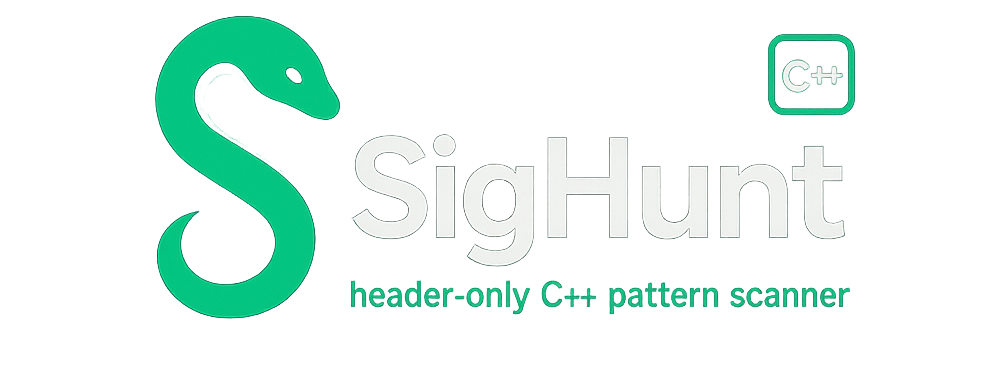

<p align="center">
  
</p>

<h1 align="center">SigHunt</h1>

<p align="center">
  <b>Header-only C++ pattern scanner</b><br>
  Ultra-fast signature scanner leveraging <b>multithreading</b> and <b>SSE (Streaming SIMD Extensions)</b>.
</p>

---

## 🚀 Overview

**SigHunt** is a lightweight, header-only C++ library designed for **pattern scanning** both in external processes and in the current (internal) module.  
It’s built for speed and simplicity — fully multithreaded and accelerated with **SSE instructions**, making it ideal for high-performance memory scanning applications.

---

## ⚙️ Features

- 🧠 **Header-only** – just include `SigHunt.h`, no build setup required.  
- ⚡ **Multithreaded scanning** – automatic parallelization for faster results.  
- 🧩 **SSE optimized** – uses vectorized comparisons for ultra-fast byte matching.  
- 🔍 **External & internal scanning** – supports both process memory and local scanning.  
- 🧱 **Cross-module compatible** – works with any PE module (DLL/EXE).  
- 🧼 **Clean and modern C++17 design** – no dependencies, no macros, no hassle.

---

## 🧰 Usage Example

```cpp
#include <iostream>
#include <chrono>
#include <vector>
#include "SigHunt.h"

int main()
{
    auto start = std::chrono::high_resolution_clock::now();

    // External scan example
    uintptr_t addr = SigHunt::External::Find("CalculatorApp.exe", "E8 C3 ?? ?? ?? ?? ?? 90");

    // Internal scan example
    uintptr_t addr2 = SigHunt::Internal::Find("E8 C3 ?? ?? ?? ?? ?? 90");

    // Retrieve all matches
    std::vector<uintptr_t> allResExternal = SigHunt::External::FindAll("CalculatorApp.exe", "E8 C3 ?? ?? ?? ?? ?? 90");
    std::vector<uintptr_t> allResInternal = SigHunt::Internal::FindAll("E8 C3 ?? ?? ?? ?? ?? 90");

    auto end = std::chrono::high_resolution_clock::now();
    auto ms = std::chrono::duration_cast<std::chrono::milliseconds>(end - start);

    std::cout << "Found at: 0x" << std::hex << addr << std::endl;
    std::cout << "Scan time: " << std::dec << ms.count() << "ms\n";

    return 0;
}
```

---

## 🧩 Integration

Simply drop [`SigHunt.h`](SigHunt.h) into your project and include it:

```cpp
#include "SigHunt.h"
```

No linking, no setup.  
The library is entirely **header-only** and **self-contained**.

---

## 🧠 Notes

- Tested on Windows 10/11 (x64)  
- Requires a compiler supporting **C++17** or higher  
- Best performance on CPUs with **SSE2+** support (almost all modern CPUs)

---

## ⚖️ License

This project is licensed under the **MIT License** — you're free to use, modify, and distribute it with attribution.  
See the [LICENSE](LICENSE) file for details.

---

## 💚 Credits

Created by **Bourdon94m** — passionate about reverse engineering, low-level C++, and system internals.  
Contributions, improvements, or optimizations are always welcome.

---
